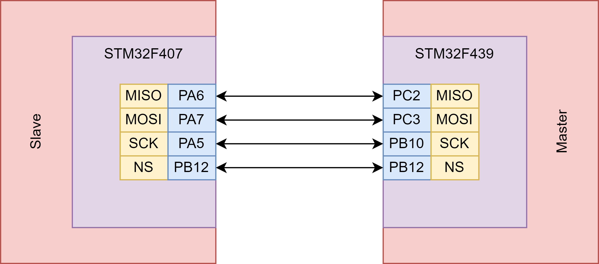

# STM32 SPI Communication Test

<!-- PROJECT LOGO -->


  <h1 align="center">STM32 SPI built-in with HAL Peripheral</h1>


<!-- TABLE OF CONTENTS -->
<details>
  <summary>Table of Contents</summary>
  <ol>
    <li>
      <a href="#about-the-project">About The Project</a>
      <ul>
        <li><a href="#built-with">Built With</a></li>
      </ul>
    </li>
    <li>
      <a href="#getting-started">Getting Started</a>
      <ul>
        <li><a href="#prerequisites">Prerequisites</a></li>
        <li><a href="#installation">Installation</a></li>
      </ul>
    </li>
    <li><a href="#usage">Usage</a></li>
    <li><a href="#roadmap">Roadmap</a></li>
    <li><a href="#contributing">Contributing</a></li>
    <li><a href="#license">License</a></li>
    <li><a href="#contact">Contact</a></li>
  </ol>
</details>


 
## About The Project

This project demonstrates the implementation of a bidirectional SPI (Serial Peripheral Interface) communication between two STM32 boards: the STM32F407 Discovery Board acting as the slave and the STM32F439ZI Board as the master. Developed using the STM32IDE and HAL (Hardware Abstraction Layer) libraries, this project provides a robust example of how to set up and manage SPI communication in an embedded system context.

<p align="right">(<a href="#readme-top">back to top</a>)</p>

### Key Features

* **Bidirectional SPI Communication:** Efficient and reliable two-way data transfer between two STM32 boards.
* **HAL Library Integration:** Utilizes the STM32 Hardware Abstraction Layer for greater code readability and easier hardware management.
* **STM32IDE Project Setup:** Project developed in the STM32 Integrated Development Environment for ease of use and compatibility.
* **Extensive Board Support:** Specific configurations for STM32F407 Discovery (slave) and STM32F439ZI (master) boards.

### Built With

 In this project, I have used some C# libraries. These libraries can be added by using Nuget Package installer.

* **STM32CubeIDE** - C/C++ development platform with peripheral configuration, code compilation, and debug features for STM32
* **STM32CubeMX** - Code generation for STM32

Moreover, it is necessary to use some softwares for building and loading C embedded code. 

* **[ST-Link CLI](https://www.st.com/en/development-tools/stsw-link004.html)** - Software interface for programming STM32 microcontrollers.
  
<p align="right">(<a href="#readme-top">back to top</a>)</p>


<!-- GETTING STARTED -->
## Getting Started
<!-- 
This is an example of how you may give instructions on setting up your project locally.
To get a local copy up and running follow these simple example steps.
-->
### Prerequisites

* STM32F407 Discovery Board
* STM32F439ZI Board
* STM32IDE installed on your system
* Basic understanding of SPI communication and STM32 development

### Installation

1. Clone this repository: git clone [repository URL].
2. Open the STM32IDE.
3. Import the project into STM32IDE by selecting File > Import.
4. Navigate to the cloned project folder and import it.

<p align="right">(<a href="#readme-top">back to top</a>)</p>

### Hardware Setup
Connect the STM32F407 Discovery Board (slave) to the STM32F439ZI Board (master) following SPI protocols.
The pins of master and slave should be connected in this format.

<div align="center">
  <a>
    
  </a>
</div> 

Ensure proper power supply and grounding for both boards.
Connect both boards to your computer via USB.

<p align="right">(<a href="#readme-top">back to top</a>)</p>

### Code Overview
#### Master Configuration (STM32F439 Discovery): 
```c
void EXTI15_10_IRQHandler(void)
{
  /* USER CODE BEGIN EXTI15_10_IRQn 0 */

  /* USER CODE END EXTI15_10_IRQn 0 */
  HAL_GPIO_EXTI_IRQHandler(GPIO_PIN_12);
  /* USER CODE BEGIN EXTI15_10_IRQn 1 */
  rec = HAL_GPIO_ReadPin(GPIOB, GPIO_PIN_12);

  if(rec == 1){ // Master to slave
	  HAL_SPI_Receive(&hspi2, RX_Data, 12, 1000);
	  
	  count_r++;

  }
  else{// Slave to Master
	  
	  HAL_SPI_Transmit_IT(&hspi2, TX_Data, 13);
	  TX_Data[0]++;
  }

  /* USER CODE END EXTI15_10_IRQn 1 */
}
```


#### Slave Configuration (STM32F407 Discovery): 

```c
while (1)
  {
    /* USER CODE END WHILE */

    /* USER CODE BEGIN 3 */

	  HAL_GPIO_WritePin(GPIOB, GPIO_PIN_12, GPIO_PIN_SET);
	  HAL_SPI_Transmit(&hspi2, TX_Data, sizeof(TX_Data), 1000);
	  HAL_GPIO_WritePin(GPIOB, GPIO_PIN_12, GPIO_PIN_RESET);
	  HAL_SPI_Receive_IT(&hspi2, RX_Data, sizeof(RX_Data));
	  HAL_Delay(2000);
	  TX_Data[0]++;

  }
```


<!-- CONTRIBUTING -->
## Contributing

Contributions are what make the open source community such an amazing place to learn, inspire, and create. Any contributions you make are **greatly appreciated**.

If you have a suggestion that would make this better, please fork the repo and create a pull request. You can also simply open an issue with the tag "enhancement".
Don't forget to give the project a star! Thanks again!

1. Fork the Project
2. Create your Feature Branch (`git checkout -b feature/AmazingFeature`)
3. Commit your Changes (`git commit -m 'Add some AmazingFeature'`)
4. Push to the Branch (`git push origin feature/AmazingFeature`)
5. Open a Pull Request

<p align="right">(<a href="#readme-top">back to top</a>)</p>


<!-- LICENSE -->
## License
 
Distributed under the MIT License. See `LICENSE.txt` for more information.

<p align="right">(<a href="#readme-top">back to top</a>)</p>


<!-- CONTACT -->
## Contact

Your Name - alirezabeigimech@gmail.com, alireza_beigi@sfu.ca

Project Link: [AlirezaBeigiMech/STM32_IDE](https://github.com/AlirezaBeigiMech/STM32_IDE)

<p align="right">(<a href="#readme-top">back to top</a>)</p>


